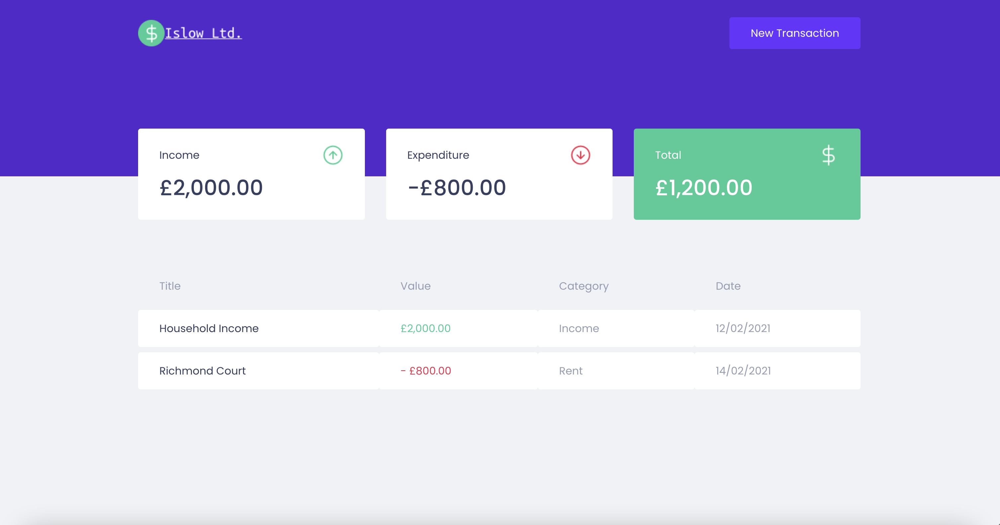

<h1 align="center">Personal finance</h1>

<h3 align="center">Personal finance control website</h3>

<div align="center">



</div>

<h3>✨ Functionalities</h3>
✔️ Record Incoming and Outgoing Activities;<br>

<h3>📋 Stack</h3>
✔️ React; <br>
✔️ Next JS; <br>
✔️ Typescript; <br>
✔️ Axios; <br>
✔️ MirageJs - for creating a fake API; <br>
✔️ Context Api; <br>
✔️ Styled Components; <br>
✔️ Polished React - for writing styles in JS; <br>
✔️ React Modal - lib for creating modals in a practical way; <br>

<h3>🏁 Start</h3>

 ```
 # clonar repo
 $ git clone https://github.com/kislow/personal-finance-control.git

 # acessar pasta
 $ cd personal-finance-control

 # install dependencies
 $ npm install

 # start
 $ npm start

```

<hr>

### 🔗Want to get in touch?

I'm on [LinkedIn](https://www.linkedin.com/in/kadir-islow-3a7777b2/).
